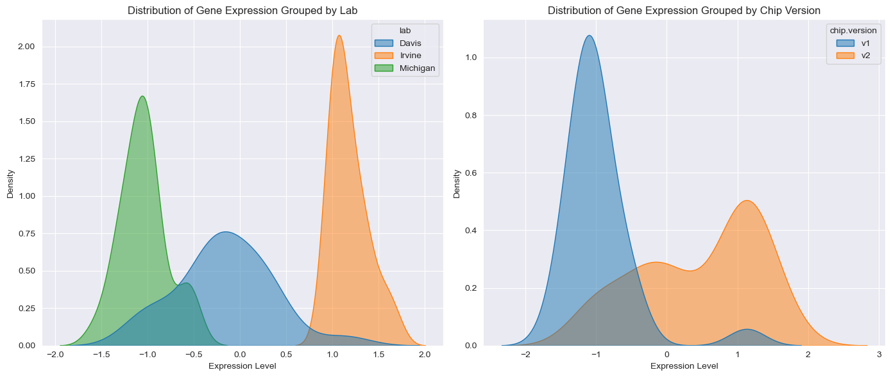
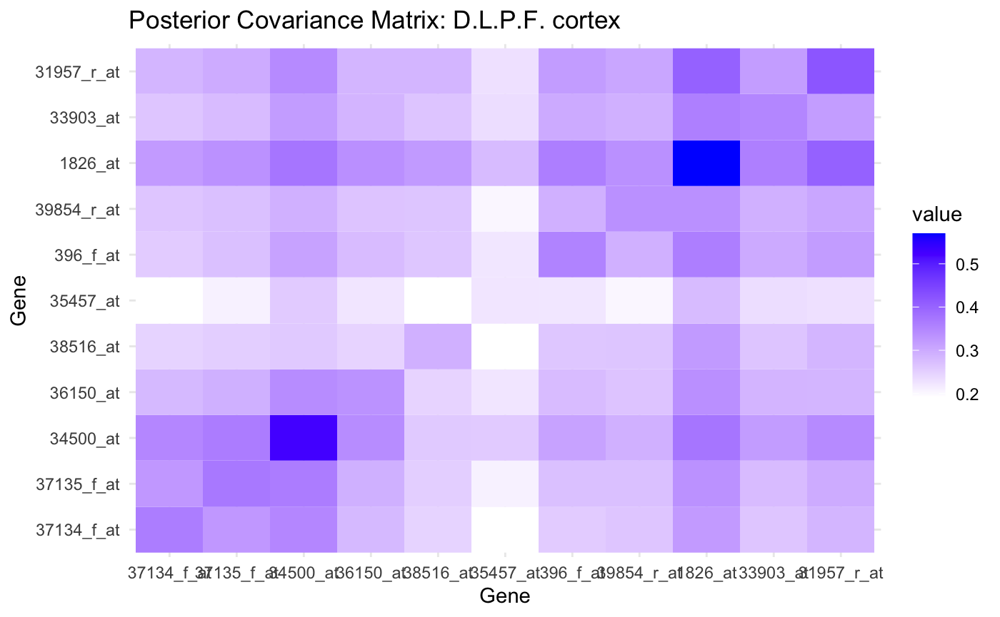

# Contents

1. [Introduction](#introduction) 

2. [Exploratory Data Analysis & Data Preparation](#exploratory-data-analysis--data-preparation)
   - 2.1 [Data Overview](#data-overview)
     - 2.1.1 [Distribution of Gene Expression](#distribution-of-gene-expression)
     - 2.1.2 [Consideration of Y Chromosome Genes](#consideration-of-y-chromosome-genes) 
   - 2.2 [Data Preparation](#data-preparation)
     - 2.2.1 [Z-Score Normalization](#z-score-normalization) 
     - 2.2.2 [Combat Batch Effect Correction (for T-test)](#combat-batch-effect-correction-for-t-test) 
   - 2.3 [Data Preparation Results](#data-preparation-results) 

3. [Methods](#methods)
   - 3.1 [T-test Analysis and T-test with Bootstrapping](#t-test-analysis-and-t-test-with-bootstrapping) 
   - 3.2 [Generalized Linear Model (GLM)](#generalized-linear-model-glm)
   - 3.3 [Random Forest Analysis](#random-forest-analysis) 
   - 3.4 [Bayesian Modeling](#bayesian-modeling)

4. [Results](#results)
   - 4.1 [Significant Genes by T-test](#significant-genes-by-t-test)
   - 4.2 [Significant Genes by GLM](#significant-genes-by-glm) 
   - 4.3 [Significant Genes by Random Forest](#significant-genes-by-random-forest)
   - 4.4 [Significant Genes by Bayesian Modeling](#significant-genes-by-bayesian-modeling) 

5. [Conclusion](#conclusion) 

[Appendix](#appendix)

\newpage

# 1 Introduction

Our dataset includes 84 samples collected from 10 patients after quality
control checks. Each sample is annotated with metadata, including their
sex, the brain region from which the sample was taken, the laboratory
source, and the chip version used for measurement.

In our analysis, the log-transformed expression intensity data is
included for 12600 genes. Each gene is represented by its symbol and
chromosome location, though 892 genes have missing identity information,
which may serve as controls.

The goal of this analysis is to identify genes with significant
differences in expression by sex (male and female) and by two brain
regions (anterior cingulate cortex and dorsolateral prefrontal cortex).
Due to the high cost of subsequent confirmatory studies, we will select
not more than 20 genes for further investigation. These genes will be
prioritized based on a confidence ranking, helping to focus future
studies on the most promising candidates for differential expression.

# 2 Exploratory Data Analysis & Data Preparation

To begin our analysis, we acknowledge that the dataset has already been
through quality control checks. As a result, all 84 samples are
included, and no additional exclusions will be made. Furthermore, we
will retain all genes for analysis, even those without complete symbol
or chromosome information, to ensure a thorough examination of all
potential candidates.

## 2.1 Data Overview

### 2.1.1 Distribution of Gene Expression

Next, we examine the distribution of gene expression levels across
laboratory source and chip version to better understand the dataset.
Figure [1](#fig:original_data){reference-type="ref"
reference="fig:original_data"} displays these distributions together,
highlighting the differences between the three laboratories, UC Davis,
Michigan, and UC Irvine, as well as between the two chip versions. The
expression levels differ notably across the labs, with UC Irvine showing
relatively higher expression levels, Michigan having lower levels, and
UC Davis displaying a middle expression level with a wider range of
variance.

Similarly, the distribution of expression levels varies by chip version,
with chip version 2 (HG U95Av2) tending to show higher expression levels
than chip version 1 (HG U95A). These patterns suggest that both
laboratory source and chip version are important factors influencing the
expression data.

These initial observations underscore the need to account for laboratory
source and chip version as potential confounders in our analysis. The
differences between the labs and chip versions suggest the presence of
batch effects, which we will address in the following steps.

### 2.1.2 Consideration of Y Chromosome Genes

To ensure a comprehensive analysis of sex-related differences in gene
expression, we examined the distribution of Y chromosome genes across
both sexes (Figure [2](#fig:Y genes){reference-type="ref"
reference="fig:Y genes"}). We observed that all selected Y chromosome
genes exhibit measurable expression in both sexes, with just some
showing slightly higher levels in males.

So in our analysis, we opted to retain Y chromosome genes. By keeping
these Y chromosome genes, we can explore potential biological roles that
they might play across both sexes, rather than dismissing them based
solely on their chromosomal location.

Additionally, excluding these genes could result in missing important
information about sex-specific gene interactions and functions. By
keeping these genes, we ensure that we capture a more complete picture
of gene expression differences, including the roles Y chromosome genes
may play in both sexes.

## 2.2 Data Preparation

In this section, we apply a two-step data preparation using $Z$-Score
normalization and Combat batch effect correction methods to prepare the
gene expression data. Each method serves a distinct purpose in ensuring
that the data is properly adjusted for biological comparison and free of
technical bias.

In our study, we utilized two datasets, the *normalized data* (the
$Z$-Score normalized data) and the *corrected data* (the normalized data
with another layer of Combat correction). Based on the characteristics
of each method, we used the *corrected data* in T-test study and the
*normalized data* in GLM and Random Forest.

### 2.2.1 Z-Score Normalization

Z-Score normalization is used first to standardize the expression values
across all samples, ensuring that each gene's expression levels are on
the same scale. This method transforms the data so that each gene has a
mean of zero and a standard deviation of one. The transformation is
represented by the following equation:

$$Z = \frac{x - \mu}{\sigma}$$

Here, $x$ represents the raw or log-transformed expression value for a
given gene, $\mu$ is the mean expression value of that gene across all
samples, and $\sigma$ is the standard deviation. By applying Z-Score
normalization, we ensure that the expression levels of all genes are
standardized and comparable across the dataset.

### 2.2.2 Combat Batch Effect Correction (for T-test)

Combat batch effect correction is used after normalization to adjust for
non-biological variability in the data that can result from differences
in experimental conditions, such as the laboratory where the sample was
processed or the chip version used. These batch effects introduce
unwanted variation that may obscure the true biological differences we
are interested in. The Combat corrected data is used specifically in
T-test analysis in our study to reduce the effect of inconsistency of
gene expression between labs and chip versions. The details will be
introduced in later section.

Combat uses an empirical Bayes framework to model and correct these
batch effects, adjusting the data while preserving the biological signal
of interest. The model used by Combat is described as:

$$Y_{ij} = \alpha_i + \beta_j + \epsilon_{ij}$$

In this model, $Y_{ij}$ represents the expression value of gene $i$ in
sample $j$, $\alpha_i$ is the gene-specific effect, $\beta_j$ represents
the batch effect (such as differences across labs or chip versions), and
$\epsilon_{ij}$ is the residual noise. Combat estimates the batch effect
$\beta_j$ and removes its influence from the expression data. This
ensures that any observed differences in gene expression are due to
biological factors, rather than technical artifacts.

## 2.3 Data Preparation Results

In this section, we compare the data structure before and after applying
the batch correction using Combat. We visualize these changes through
both direct distribution plots and Principal Component Analysis (PCA) to
assess the effectiveness of the correction.

First, we examine the distribution of the corrected data by laboratory
and chip version. Figure [3](#fig:batch_correction){reference-type="ref"
reference="fig:batch_correction"} shows the distribution of the data
points for the corrected dataset, grouped by lab and by chip version.
After the batch correction, there is a significant overlap in the
distribution of data points across the three labs and two chip versions,
indicating that the method effectively mitigated the batch effect. The
distinction between the different labs and chip versions is greatly
reduced, resulting in a more homogeneous dataset.

To further demonstrate the effect of batch correction, we visualize the
dataset using Principal Component Analysis (PCA).
Figures [4](#fig:PCA_lab){reference-type="ref" reference="fig:PCA_lab"}
and [5](#fig:PCA_chip){reference-type="ref" reference="fig:PCA_chip"}
illustrate the PCA structure of the data before and after correction.
Both plots represent the same underlying PCA data structure, but one
figure highlights the data points by laboratory source and the other by
chip version.

Before correction, clear clustering is visible based on laboratory
source and chip version, suggesting that the batch effect is driving
significant differences in the dataset. However, after batch correction,
these clusters become less distinct, as evidenced by the mixture of data
points from different labs and chip versions. This indicates that the
batch effect has been successfully mitigated.

Additionally, when comparing the two PCA plots, we observe a large
overlap between data points from the Michigan laboratory and those
corresponding to chip version 1. This suggests that the Michigan lab
predominantly used chip version 1 for its measurements.

In conclusion, the batch effect correction using Combat significantly
reduced the influence of both laboratory source and chip versions on the
data. By using the corrected data, we can analyze samples from different
labs and chip versions together, eliminating the need to perform
separate T-tests for each lab.

# 3 Methods

We will use multiple methods to analyze the data and detect significant
differentially expressed genes. Below is an overview of the statistical
models and algorithms used:

## 3.1 T-test Analysis and T-test with Bootstrapping

We apply Welch's $t$-test to detect differentially expressed genes
between sexes and brain regions. Welch's $t$-test, which accounts for
unequal variances between groups, calculates the test statistic as:

$$t = \frac{\bar{x}_1 - \bar{x}_2}{\sqrt{\dfrac{s_1^2}{n_1} + \dfrac{s_2^2}{n_2}}}$$

where $\bar{x}_1$ and $\bar{x}_2$ are the group means, $s_1^2$ and
$s_2^2$ are the variances, and $n_1$ and $n_2$ are the sample sizes.
$p$-values are adjusted to control for false discovery.

As a follow-up method, we apply bootstrapping by resampling the data 500
times. In each run, we perform Welch's $t$-test and select the top 50
genes based on adjusted p-values. Genes are ranked by how frequently
they appear in the top 50 across iterations. The top five genes with the
highest frequencies are reported for further investigation, offering a
measure of consistency in differential expression across multiple
resamples. This method allows us to further validate the results from
initial t-test and recognize some genes that consistently show
differential expressions even though they do not reach the statistical
significance.

## 3.2 Generalized Linear Model (GLM)

We fit a Generalized Linear Model (GLM) to the normalized gene
expression data without applying Combat batch effect correction.
Instead, the model incorporates laboratory source and chip version as
covariates to adjust for these variables.

We apply Bonferroni correction with $\alpha = 0.05$ to control the
family-wise error rate, and we report genes with a corrected $p$-value
below 0.05 as significant.

## 3.3 Random Forest Analysis

We applied a Random Forest model to the normalized gene expression data,
treating laboratory source and chip version as dummy variables to adjust
for batch effects. The Random Forest algorithm uses an ensemble of
decision trees to rank the importance of genes based on Gini importance,
which measures the contribution of each gene to reducing impurity in the
trees. Cross-validation was employed to minimize the risk of
overfitting, ensuring the stability of the feature rankings. Genes with
the top 5 Gini importance were identified as key candidates for further
biological interpretation.

## 3.4 Bayesian Modeling

In this Bayesian approach, we aim to estimate the group mean $\theta$
and group covariance matrix $\Sigma$ for the two independent groups:
either male versus female or the anterior cingulate cortex versus
dorsolateral prefrontal cortex. We assume no interaction between groups
and model each group using a multivariate normal distribution. For each
group, we assume the prior for $\theta$ follows a normal distribution
$\theta \sim N(\mu_0, \Sigma_0)$, and $\Sigma$ follows an
inverse-Wishart distribution
$\Sigma \sim \text{Inverse-Wishart}(\nu_0, S_0^{-1})$.

To update the posterior distribution of the parameters, we use Gibbs
sampling. The conditional posterior for $\theta$ is a normal
distribution, given by:

$$\theta | Y, \Sigma \sim N\left( \left(\Sigma_0^{-1} + n\Sigma^{-1}\right)^{-1}\left(\Sigma_0^{-1}\mu_0 + n\Sigma^{-1} \bar{Y}\right), \left(\Sigma_0^{-1} + n\Sigma^{-1}\right)^{-1} \right),$$

where $\bar{Y}$ is the mean of the observed data, and $n$ is the sample
size. The posterior for $\Sigma$ is updated using an inverse-Wishart
distribution:

$$\Sigma | Y, \theta \sim \text{Inverse-Wishart}(\nu_0 + n, S_0 + \sum_{i=1}^{n}(Y_i - \theta)(Y_i - \theta)^T),$$

where $\nu_0$ is the degrees of freedom, and $S_0$ is the scale matrix.
We run 1100 iterations of the Gibbs sampler, discarding the first 100 as
burn-in, to estimate the posterior distributions of the group means and
covariance matrices.

To reduce the computational burden, we limit our analysis to genes
identified as significant in previous steps, including $t$-tests, Random
Forest, and GLM results. We calculate the difference between the
posterior means of the two groups and rank the genes based on the
magnitude of this difference. The top five genes with the largest
differences are reported as the most differentially expressed. We also
visualize the posterior covariance matrix to understand the
relationships between the selected genes.

# 4 Results

In this section, we present the significant genes identified by each
method, focusing on the comparison between male and female, and between
the two brain regions (A.C. cortex and D.L.P.F. cortex).

## 4.1 Significant Genes by T-test

Using the batch effect corrected data, a standard $t$-test was performed
to identify differentially expressed genes. For the comparison between
male and female, two genes were found to be significantly differentially
expressed. The table below summarizes these genes along with their
adjusted p-values.

   **Gene Name**   **Symbol**   **Chromosome**   **Adjusted p-value**
  --------------- ------------ ---------------- -----------------------
     41214_at        RPS4Y1           Y          $2.4 \times 10^{-13}$
     38355_at        DDX3Y            Y          $2.4 \times 10^{-9}$

  : Significant differentially expressed genes between male and female
  from $t$-test

However, no significant differentially expressed genes were found
between the two brain regions (A.C. cortex and D.L.P.F. cortex) using
the standard $t$-test. Therefore, it became necessary to apply the
bootstrap technique to further explore potential differences. By
resampling 500 times, we ranked the genes by their frequency of
appearance in the top 50 significant genes in each iteration.

Below, the top five genes ranked by frequency for the comparison between
male and female are shown:

   **Gene Name**   **Symbol**   **Chromosome**   **Frequency**
  --------------- ------------ ---------------- ---------------
     41214_at        RPS4Y1           Y              1.000
     38355_at        DDX3Y            Y              1.000
     37583_at        KDM5D            Y              0.688
     35885_at        USP9Y            Y              0.658
      1000_at        MAPK3            16             0.556

  : Top 5 differentially expressed genes between male and female by
  Bootstrap

The bootstrap analysis for the sex problem revealed a high degree of
overlap with the standard $t$-test results. The top two genes identified
by the $t$-test, RPS4Y1 and DDX3Y, were also consistently selected in
100% of the bootstrap iterations, further validating their significance
as differentially expressed between males and females. The additional
genes identified through bootstrapping, such as KDM5D and USP9Y, provide
supplementary evidence for other potential candidates that may not have
reached statistical significance in the original test but demonstrate
consistent differential expression across resampling.

For the comparison between A.C. cortex and D.L.P.F. cortex, the top five
genes ranked by frequency from the bootstrap resampling are presented in
the following table:

   **Gene Name**   **Symbol**   **Chromosome**   **Frequency**
  --------------- ------------ ---------------- ---------------
    37134_f_at       GRIN1            9              0.602
    37135_f_at       GRIN1            9              0.484
     34500_at        CABP1            12             0.420
     36150_at       PLEKHM2           1              0.404
     38516_at        SCN1B            19             0.380

  : Top 5 differentially expressed genes between A.C. cortex and
  D.L.P.F. cortex by Bootstrap

In contrast to the sex analysis, although the top-ranked genes were
identified, the results from the bootstrap analysis were not ideal. The
highest gene appearance frequency was only around 60%, indicating a lack
of consistency in identifying these genes as differentially expressed
across the two brain regions. Rather than viewing these findings as
definitive, we recommend using them as a reference for future
investigations.

## 4.2 Significant Genes by GLM

The Generalized Linear Model (GLM) was applied to the normalized data,
accounting for potential batch effects by including laboratory source
and chip version as covariates. Two genes were found to be significantly
differentially expressed between male and female, as shown in the table
below:

   **Gene Name**   **Symbol**   **Chromosome**   **Adjusted p-value**
  --------------- ------------ ---------------- -----------------------
     41214_at        RPS4Y1           Y          $2.5 \times 10^{-26}$
     38355_at        DDX3Y            Y          $1.6 \times 10^{-14}$

  : Significant differentially expressed genes between male and female
  from GLM

These two genes, RPS4Y1 and DDX3Y, were also identified by both the
$t$-test and bootstrap methods, confirming their strong differential
expression between male and female groups.

For the comparison between A.C. cortex and D.L.P.F. cortex, one gene was
found to be significantly differentially expressed, as presented below:

   **Gene Name**   **Symbol**   **Chromosome**   **Adjusted p-value**
  --------------- ------------ ---------------- ----------------------
     35457_at        CARTPT           5                $0.021$

  : Significant differentially expressed gene between A.C. cortex and
  D.L.P.F. cortex from GLM

In contrast to the $t$-test, which did not identify any significant
genes between the brain regions, GLM detected CARTPT as a differentially
expressed gene. This suggests that including batch effect covariates may
provide additional sensitivity in detecting expression differences
between brain regions.

## 4.3 Significant Genes by Random Forest

Using the Random Forest model, we ranked genes based on their Gini
importance, which measures each gene's contribution to reducing impurity
in the classification trees. The table below presents the top 5 genes
identified based on their Gini importance for the comparison between
male and female:

   **Gene Name**   **Symbol**   **Chromosome**   **Gini Importance**
  --------------- ------------ ---------------- ---------------------
     41214_at        RPS4Y1           Y                0.0103
     38355_at        DDX3Y            Y                0.0075
    35680_r_at        DPP6            7                0.0032
    31687_f_at        HBB             11               0.0031
     38446_at         XIST            X                0.0028

  : Top 5 genes ranked by Gini importance for male vs. female from
  Random Forest

Similarly, the top 5 genes ranked by Gini importance for the comparison
between A.C. cortex and D.L.P.F. cortex are shown in the table below:

   **Gene Name**   **Symbol**   **Chromosome**   **Gini Importance**
  --------------- ------------ ---------------- ---------------------
     396_f_at         EPOR            19               0.0044
    39854_r_at       PNPLA2           11               0.0034
      1826_at         RHOB            2                0.0029
     33903_at        DAPK3            19               0.0025
    31957_r_at       RPLP1            15               0.0024

  : Top 5 genes ranked by Gini importance for A.C. cortex vs. D.L.P.F.
  cortex from Random Forest

The results from the Random Forest analysis show notable overlap with
the previous methods for the comparison between male and female.
Specifically, the genes RPS4Y1 and DDX3Y, which were identified as
significant in both the $t$-test and GLM methods, also ranked highest in
terms of Gini importance. This consistent identification across multiple
methods strengthens the evidence for these genes' differential
expression between sexes.

In contrast, the Random Forest analysis for the brain region comparison
revealed no overlap with the results from the GLM or bootstrap methods.
The top genes identified here, such as EPOR and PNPLA2, were not
previously highlighted by the other methods. This lack of overlap could
suggest that the Random Forest model is capturing a different aspect of
the data, or that the brain region differences are more subtle and
detected differently depending on the model used. Further investigation
into these genes may be necessary to understand their role in brain
region-specific expression.

## 4.4 Significant Genes by Bayesian Modeling

For the Bayesian modeling, we focused on a subset of genes identified as
candidates from previous methods. Specifically, we analyzed 8 candidate
genes for the male vs. female comparison and 11 candidate genes for the
A.C. cortex vs. D.L.P.F. cortex comparison. The tables below present the
top 5 genes from each comparison, ranked by the difference in their
posterior means.

**Top 5 genes for male vs. female comparison:**

   **Gene Name**   **Symbol**   **Chromosome**   **Mean Difference**
  --------------- ------------ ---------------- ---------------------
     41214_at        RPS4Y1           Y                 1.265
     38355_at        DDX3Y            Y                 0.868
    31687_f_at        HBB             11                0.572
     37583_at        KDM5D            Y                 0.420
     35885_at        USP9Y            Y                 0.376

  : Top 5 genes ranked by mean difference for male vs. female from
  Bayesian modeling

**Top 5 genes for A.C. cortex vs. D.L.P.F. cortex comparison:**

   **Gene Name**   **Symbol**   **Chromosome**   **Mean Difference**
  --------------- ------------ ---------------- ---------------------
     34500_at        CABP1            12                1.013
    37135_f_at       GRIN1            9                 0.477
    31957_r_at       RPLP1            15                0.450
    37134_f_at       GRIN1            9                 0.410
     38516_at        SCN1B            19                0.293

  : Top 5 genes ranked by mean difference for A.C. cortex vs. D.L.P.F.
  cortex from Bayesian modeling

In this confirmation study, Bayesian modeling reaffirms several of the
previously identified significant genes from other methods. For the male
vs. female comparison, RPS4Y1 and DDX3Y continue to show large mean
differences, further validating their differential expression. HBB,
which appears on chromosome 11, also exhibits a noticeable difference,
indicating its potential role in the biological processes.

Next, we visualize the posterior covariance matrices for the male and
female groups, and for the A.C. cortex and D.L.P.F. cortex groups. The
posterior covariance matrices allow us to observe the relationships
between the selected genes in each group.

| Posterior covariance matrix for male | Posterior covariance matrix for female |
|:-----------------------------------:|:-------------------------------------:|
|    |   |

The covariance matrices for male and female groups reveal some key
differences. In the male group, HBB, located on chromosome 11, exhibits
nearly zero covariance with other genes. In contrast, in the female
group, HBB shows higher covariance with other genes, suggesting
potential interactions or regulatory effects that differ between the
sexes.

| Posterior covariance matrix for A.C. cortex | Posterior covariance matrix for D.L.P.F. cortex |
|:-------------------------------------------:|:----------------------------------------------:|
|       |    |

For the A.C. cortex and D.L.P.F. cortex comparison, the covariance
matrices show distinct patterns. Genes such as CABP1 and GRIN1 exhibit
stronger covariance in one brain region over the other, suggesting that
these genes might play region-specific roles in brain function. The
differences in covariance patterns between A.C. cortex and D.L.P.F.
cortex provide further evidence of brain region-specific gene
expression, which may underlie functional differences between these
areas.

In summary, the Bayesian modeling results confirm the differential
expression of key genes identified in previous methods and provide
deeper insight into the covariance structures, offering clues to the
complex interactions between these genes within each group.

# 5 Conclusion

In this section, we summarize the findings from the different
statistical and machine learning methods, presenting a confidence
stratification of the identified genes for both the male vs. female
comparison and the A.C. cortex vs. D.L.P.F. cortex comparison.

    **Name**    **Symbol**   **Chromosome**             **Tests**             **Confidence**
  ------------ ------------ ---------------- ------------------------------- ----------------
    41214_at      RPS4Y1           Y          T-test, Boots, GLM, RF, Bayes        High
    38355_at      DDX3Y            Y          T-test, Boots, GLM, RF, Bayes        High
    35885_at      USP9Y            Y                  Boots, Bayes                Medium
    37583_at      KDM5D            Y                  Boots, Bayes                Medium
   31687_f_at      HBB             11                   RF, Bayes                 Medium
   35680_r_at      DPP6            7                       RF                      Low
    38446_at       XIST            X                       RF                      Low
    1000_at       MAPK3            16                     Boots                    Low

  : Confidence stratification for male vs. female comparison

    **Name**    **Symbol**   **Chromosome**    **Tests**     **Confidence**
  ------------ ------------ ---------------- -------------- ----------------
   37134_f_at     GRIN1            9          Boots, Bayes       Medium
   37135_f_at     GRIN1            9          Boots, Bayes       Medium
    34500_at      CABP1            12         Boots, Bayes       Medium
    38516_at      SCN1B            19         Boots, Bayes       Medium
   31957_r_at     RPLP1            15          RF, Bayes         Medium
    36150_at     PLEKHM2           1             Boots            Low
    396_f_at       EPOR            19              RF             Low
   39854_r_at     PNPLA2           11              RF             Low
    1826_at        RHOB            2               RF             Low
    33903_at      DAPK3            19              RF             Low
    35457_at      CARTPT           5              GLM             Low

  : Confidence stratification for A.C. cortex vs. D.L.P.F. cortex
  comparison

For the male vs. female comparison, we highly recommend further
investigation of the high-confidence genes, RPS4Y1 and DDX3Y, as they
were consistently significant across all methods, indicating strong
evidence of differential expression. Medium-confidence genes, such as
USP9Y and KDM5D, also warrant additional investigation due to their
consistent identification in bootstrap and Bayesian methods. However,
the low-confidence genes identified by only one or two methods, such as
DPP6 and MAPK3, are not recommended for immediate focus without further
supporting evidence.

For the A.C. cortex vs. D.L.P.F. cortex comparison, none of the
identified genes achieved high confidence, indicating that additional
evidence is needed to support strong conclusions about differential
expression in these brain regions. However, we suggest a thorough but
cautious investigation of the medium-confidence genes, such as GRIN1 and
CABP1, which were identified across multiple methods, making them the
most promising candidates. Some of the low-confidence genes, like EPOR
and CARTPT, may also merit further exploration given their
identification in specific models, but they should be approached with
care due to their limited evidence.

# Appendix

All codes of data processing and algorithms are stored in Jupyter notebook and R Markdown. Notebooks, R Markdown, images, and Markdown files for report can be found in the project’s GitHub repository: [Differential_Gene_Expression_604proj2](https://github.com/judywu4800/Differential_Gene_Expression_604proj2)
